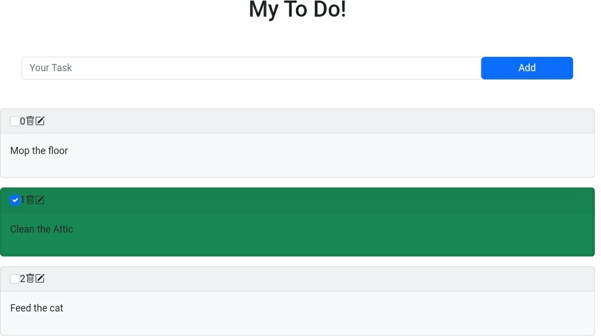

# simple-vue-todolist
This is a simple To Do List application that I made from learning VueJS, without any NPM packages installed

## Screenshot 📸

## Tech ⚙️

* [Vue](https://vuejs.org)

* [Bootstrap](https://getbootstrap.com)

* [Toastify](https://github.com/apvarun/toastify-js)

## Features ✨

* Tasks Stored in localStorage so you don't lose it easily

* Without NPM, all packages are loaded from html scripts

* Marked green if the checkbox is marked as complete

* Notifications during updates in the contents of tasks

* Delete the Tasks list specifically 

* Modify the task list specifically 

## Run
Run with anything that can run an HTTP server, like `python -m http.server`
